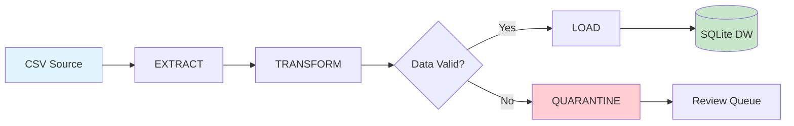

<div align="center">

#  Enterprise ETL Pipeline

[](https://python.org)
[](https://pandas.pydata.org)
[](https://sqlite.org)

**A production-ready ETL pipeline demonstrating enterprise data engineering best practices**

[Features](#-features)  [Quick Start](#-quick-start)  [Architecture](#-architecture)  [Documentation](#-data-model)

---

</div>

##  What is This?

This project implements a **professional ETL (Extract, Transform, Load) pipeline** that:

-  **Extracts** raw sales data from CSV files
-  **Transforms** data with validation & star schema modeling  
-  **Loads** clean data into a SQLite data warehouse
-  **Quarantines** bad records for review (instead of deleting them!)

>  Perfect for learning data engineering concepts or as a template for real-world projects.

---

##  Features

<table>
<tr>
<td width="50%">

###  Data Quality
- Automatic validation rules
- Bad data quarantine system
- No data loss - everything tracked

</td>
<td width="50%">

###  Star Schema
- Dimension tables (`dim_product`)
- Fact tables (`fact_sales`)
- Optimized for analytics

</td>
</tr>
<tr>
<td width="50%">

###  Professional Logging
- Console + file logging
- Timestamped entries
- Multiple log levels

</td>
<td width="50%">

###  Easy to Use
- Single command execution
- Auto-generates test data
- Clear configuration

</td>
</tr>
</table>

---

##  Quick Start

### Prerequisites

```
Python 3.7+    pip
```

### Installation

```bash
# Clone the repository
git clone https://github.com/BHAVIK-RADADIYA1/enterprise-etl-pipeline.git
cd enterprise-etl-pipeline

# Install dependencies
pip install pandas
```

### Run the Pipeline

```bash
python advance_etl.py
```

###  Expected Output

```
 Generated dummy raw data file.
 Starting Extraction phase...
    Extracted 6 rows from source.
 Starting Transformation & Modeling phase...
    Quarantined 2 bad rows to quarantine_data.csv
    Transformed data. 4 clean rows ready for loading.
 Starting Loading phase...
    Loaded 'dim_product' table.
    Loaded 'fact_sales' table.
 ETL Pipeline Completed Successfully.

--- ANALYTICS REPORT: Revenue by Category ---
      category  total_revenue
0  Accessories             50
1  Electronics           1800
```

---

##  Architecture



### Pipeline Flow

| Phase | Description | Output |
|-------|-------------|--------|
| **Extract** | Read raw CSV data | DataFrame in memory |
| **Transform** | Validate, clean, model into star schema | Dimension + Fact tables |
| **Load** | Write to SQLite database | Persistent storage |
| **Quarantine** | Isolate bad records | CSV for review |

---

##  Project Structure

```
enterprise-etl-pipeline/

  advance_etl.py           # Main ETL pipeline
  daily_sales_raw.csv      # Input data (auto-generated)
  quarantine_data.csv      # Bad records for review
  enterprise_warehouse.db  # SQLite data warehouse
  pipeline_logs.log        # Execution logs
  README.md                # You are here!
```

---

##  Data Model

### Star Schema Design

<div align="center">

```
                    
                        dim_product      
                    
                      product_id (PK)  
                        product          
                        category         
                        price            
                    
                               
                                1:N
                               
                    
                        fact_sales       
                    
                        order_id         
                        transaction_date 
                        customer_name    
                      product_id (FK)  
                        quantity         
                        total_amount     
                    
```

</div>

###  Sample Analytics Query

```sql
-- Revenue by Category Report
SELECT 
    p.category, 
    SUM(f.total_amount) as total_revenue
FROM fact_sales f
JOIN dim_product p ON f.product_id = p.product_id
GROUP BY p.category
ORDER BY total_revenue DESC;
```

---

##  Configuration

All settings are centralized at the top of `advance_etl.py`:

```python
#  File Paths
DB_NAME = "enterprise_warehouse.db"    # Output database
LOG_FILE = "pipeline_logs.log"         # Log file
RAW_FILE = "daily_sales_raw.csv"       # Input source
QUARANTINE_FILE = "quarantine_data.csv" # Bad data storage
```

---

##  Data Quality Rules

| Rule | Condition | Action |
|:-----|:----------|:-------|
|  Null Check | `customer_name` is NULL |  Quarantine |
|  Price Validation | `price <= 0` |  Quarantine |

>  Quarantined records are **never deleted** - they are saved to `quarantine_data.csv` for manual review and correction.

---

##  Key Concepts Demonstrated

<details>
<summary><b> ETL Best Practices</b></summary>

- Clear separation of Extract, Transform, Load phases
- Each phase is a separate function for maintainability
- Error handling at each stage
</details>

<details>
<summary><b> Data Quality Management</b></summary>

- Quarantine pattern preserves all data
- Bad records available for review and correction
- No silent data loss
</details>

<details>
<summary><b> Dimensional Modeling</b></summary>

- Star schema with surrogate keys
- Dimension tables for descriptive attributes
- Fact tables for measurable events
</details>

<details>
<summary><b> Professional Logging</b></summary>

- Dual output: console + file
- Timestamps for debugging
- Multiple severity levels (INFO, WARNING, ERROR)
</details>

---

##  Contributing

Contributions are welcome! Feel free to:

1.  Fork the repository
2.  Create a feature branch
3.  Make your changes
4.  Submit a pull request

---
